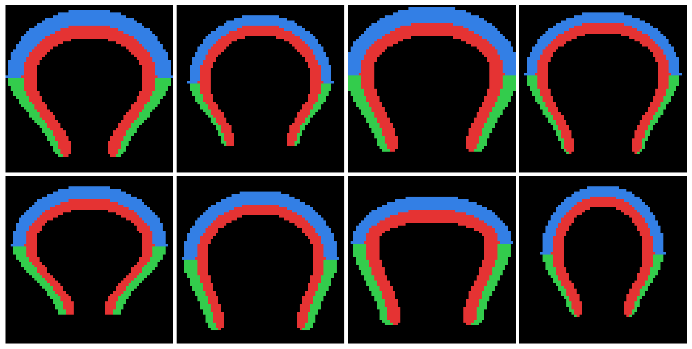

# EpureDGM - Deep Generative Models for Multi-Component Images

Framework for training and evaluating 9 generative models on multi-component image datasets.

## Models

**Diffusion Models**: DDPM, MDM, Flow Matching
**VAE Models**: VAE, GMRF-MVAE, Meta-VAE, VQVAE, MMVAEplus
**GAN Models**: WGAN-GP

> **Note**: MMVAEplus and Meta-VAE training incomplete (multiprocessing issues on Windows, marginal decoders already trained for seed 1)

## Datasets

### EPURE Dataset (Private)
The EPURE dataset contains proprietary tire cross-section images with **5 components**:
- `group_nc` (carcass) - Red in visualizations
- `group_km` (crown) - Blue in visualizations
- `bt` (belt) - Yellow in visualizations
- `fpu` (sidewalls) - Green in visualizations
- `tpc` (tread pattern) - Cyan in visualizations

**Format**: 64x32 grayscale images with 2D conditions (width_px, height_px) or 4D performance metrics

> **Note**: EPURE dataset is not included in this public repository due to proprietary constraints.

### Toy Dataset (Public Benchmark)
An open-source benchmark dataset with **3 components** (group_nc, group_km, fpu) for reproducible experiments.

**Format**: 64x32 grayscale images, 20,000 samples (train/test split)


*Figure: Toy dataset samples showing multi-component tire cross-sections. Each image is a color overlay of 3 components: carcass (red), crown (blue), sidewalls (green). Images are mirrored horizontally for square display (64x64).*

## Quick Start

### Installation
```bash
pip install -r requirements.txt
```

### Toy Dataset Generation (Required for MDM/categorical models)

The toy dataset must be generated before training MDM or other categorical models:

```bash
# Step 1: Generate toy images + performances.csv
cd data/toy_epure
python generate_toy_dataset.py

# Step 2: Create categorical masks for MDM
python create_categorical_masks_toy.py
cd ../..
```

This generates:
- **20,000 images** (train/test split)
- **performances.csv** with conditions (width_px, height_px, etc.)
- **Categorical masks** in `data/toy_epure/preprocessed/` (required for MDM)

> **Note**: EPURE dataset preprocessing is already done. Only toy dataset needs generation.

### Full Training Pipeline (All Models)
```bash
python scripts/pipeline/run_pipeline.py --dataset epure
```

This runs training (100 epochs, 3 seeds), sampling (unconditional/conditional/inpainting), and evaluation (FID, IoU/Dice, CoM, RCE).

**Time**: ~25-35 hours
**Disk**: ~8 GB

### Pipeline Customization

**Run specific models only:**
```bash
python scripts/pipeline/run_pipeline.py --dataset epure --models ddpm,vae,gmrf_mvae
```

**Custom seeds:**
```bash
python scripts/pipeline/run_pipeline.py --dataset epure --seeds 42,123,456
```

**Skip training (sampling + evaluation only):**
```bash
python scripts/pipeline/run_pipeline.py --dataset epure --skip-training
```

**Skip sampling (training only):**
```bash
python scripts/pipeline/run_pipeline.py --dataset epure --skip-sampling --skip-evaluation
```

**Skip evaluation (training + sampling only):**
```bash
python scripts/pipeline/run_pipeline.py --dataset epure --skip-evaluation
```

**Combine options (specific models + seeds, no evaluation):**
```bash
python scripts/pipeline/run_pipeline.py --dataset epure --models ddpm,vae --seeds 0,1 --skip-evaluation
```

**Toy dataset (3 components, faster for testing):**
```bash
python scripts/pipeline/run_pipeline.py --dataset toy
```

### Custom Conditions

All EPURE configs use **geometric conditions** by default (`width_px`, `height_px`).

To use different conditions (e.g., `d_cons_norm`, `d_rigid_norm`, `d_life_norm`, `d_stab_norm`):

**Option 1: Edit configs directly** (recommended)
```bash
# Edit src/configs/pipeline/epure/<model>_epure_pipeline.yaml
# Change condition_columns and cond_dim (if applicable)
```

**Option 2: Create alternative configs**
```bash
# Copy and modify: gmrf_mvae_epure_pipeline_perf.yaml
# Then train with: --config src/configs/.../gmrf_mvae_epure_pipeline_perf.yaml
```

Available condition columns in `performances.csv`:
- Geometric: `width_px`, `height_px` (2 conditions)
- Performance: `d_cons_norm`, `d_rigid_norm`, `d_life_norm`, `d_stab_norm` (4 conditions)

### Quick Validation (1 epoch)
```bash
python scripts/pipeline/validate_models_complete.py --dataset test --models all
```

## Manual Usage

### Single Model Training

Train one model with a specific seed:
```bash
python src/models/gmrf_mvae/train.py --config src/configs/pipeline/epure/gmrf_mvae_epure_pipeline.yaml --seed 42
```

Train with custom epochs:
```bash
python src/models/vae/train.py --config src/configs/pipeline/epure/vae_epure_pipeline.yaml --epochs 200 --seed 0
```

### Manual Sampling

**Unconditional sampling** (generates random samples):
```bash
python src/models/ddpm/sample.py \
  --checkpoint outputs/ddpm/run_seed0/check/checkpoint_best.pt \
  --mode unconditional \
  --num_samples 1000
```

**Conditional sampling** (uses test set conditions):
```bash
python src/models/vae/sample.py \
  --checkpoint outputs/vae/run_seed0/check/checkpoint_best.pt \
  --mode conditional \
  --seed 42
```
> **Note**: Conditional mode uses test set size, not `--num_samples`.

**Inpainting** (reconstruct masked components):
```bash
python src/models/gmrf_mvae/sample.py \
  --checkpoint outputs/gmrf_mvae/run_seed0/check/checkpoint_best.pt \
  --mode inpainting \
  --components fpu \
  --seed 42
```

**Supported modes by model:**
- All models: unconditional, conditional
- Not supported: inpainting for MDM, WGAN-GP

### Evaluation

Evaluate specific model across seeds:
```bash
python src/scripts/evaluate.py --model gmrf_mvae --dataset epure --seeds 0,1,2
```

Evaluate all models:
```bash
python src/scripts/evaluate.py --model all --dataset epure --seeds 0,1,2
```

**Metrics computed:**
- **FID**: Frechet Inception Distance (image quality)
- **IoU/Dice**: Component overlap (segmentation accuracy)
- **CoM**: Center of Mass distance (spatial accuracy)
- **RCE**: Relative Classification Error (component classification)

## Monitoring GPU

```powershell
powershell .\scripts\monitor_gpu.ps1
```

## Project Structure

```
epure_dgm_new/
├── src/
│   ├── models/          # 9 model implementations
│   ├── evaluation/      # Metrics (FID, IoU/Dice, CoM, RCE)
│   ├── configs/         # YAML configs
│   └── scripts/         # Train/sample scripts
├── scripts/
│   └── pipeline/        # Automation scripts
├── data/
│   ├── epure/           # EPURE dataset (private)
│   └── toy_epure/       # TOY dataset (public)
└── outputs/             # Checkpoints & samples
```

## Key Features

- **9 Models**: DDPM, MDM, Flow Matching, VAE, GMRF-MVAE, Meta-VAE, VQVAE, MMVAEplus, WGAN-GP
- **3 Sampling Modes**: Unconditional, conditional (test set conditions), inpainting (component reconstruction)
- **4 Evaluation Metrics**: FID, IoU/Dice, CoM, RCE
- **Multi-seed Support**: Statistical robustness (default: 3 seeds)
- **Flexible Pipeline**: Skip stages, run specific models/seeds, customize conditions
- **Rectangular Images**: 64x32 support for EPURE, 64x64 for visualization

## Component Naming Conventions

Across datasets, components are named consistently:
- **group_nc** = carcass (structural layer)
- **group_km** = crown (top layer)
- **fpu** = sidewalls (lateral reinforcement)
- **bt** = belt (reinforcement layer, EPURE only)
- **tpc** = tread pattern (contact layer, EPURE only)

## Technical Notes

- **Checkpoints**: Saved every 25 epochs + best checkpoint (lowest validation loss)
- **Rectangular Images**: EPURE uses 64x32, mirrored to 64x64 for visualization
- **Conditional Sampling**: Uses actual test set conditions, not random sampling
- **Inpainting**: Not supported by MDM and WGAN-GP (architecture constraints)
- **TOY Dataset**: Open-source benchmark for reproducibility (EPURE is private)
