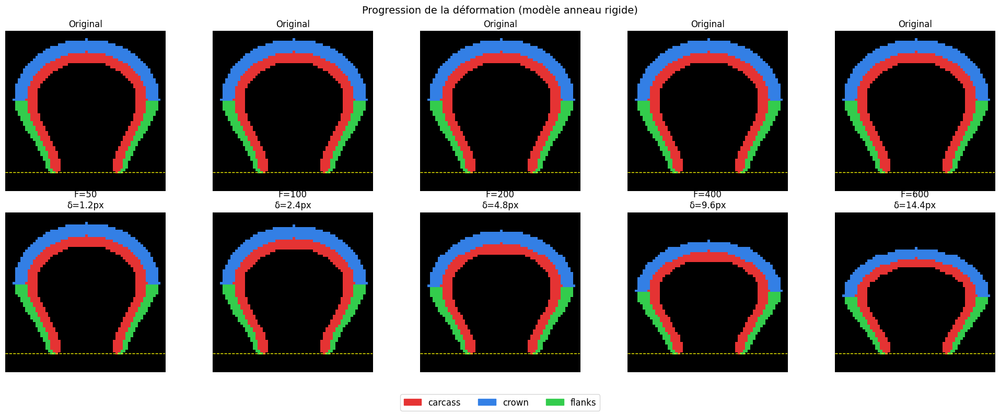

# Tire Deformation Benchmark

> A modular, extensible benchmark for tire geometry generation and mechanical deformation simulation



*Figure: Progressive tire deformation under increasing vertical load (F=50 to F=600). The rigid ring model accurately captures crown descent and lateral bulge.*

---

## 🎯 Features

- **🔧 Modular Components**: Variable number of tire components (carcass, crown layers, flanks, custom)
- **📊 Pluggable Metrics**: Easy-to-extend performance metrics using class inheritance
- **⚙️ Configuration-First**: Define tires and datasets using YAML/JSON configs
- **📦 Dataset Generation**: Built-in tools with Latin Hypercube Sampling for generating large-scale datasets
- **✅ Evaluation Suite**: Comprehensive evaluation for generative models
- **📈 Beautiful Visualizations**: Per-metric visualizations and comparisons
- **🚀 Extensible**: Add new components or metrics without modifying existing code (Open-Closed Principle)

---

## 🏗️ Architecture

### Core Components

```
tire-deformation-benchmark/
├── tire_bench/              # Main package
│   ├── core/               # ComponentBase, Tire, MaterialProperties
│   ├── geometry/           # Component generators (Carcass, Crown, Flanks)
│   ├── mechanics/          # RigidRingModel (deformation physics)
│   ├── metrics/            # BaseMetric + built-in metrics
│   ├── dataset/            # DatasetGenerator with Latin Hypercube Sampling
│   ├── evaluation/         # DeformationEvaluator
│   └── visualization/      # Plotting utilities
├── configs/examples/       # YAML configuration templates
├── examples/               # Python example scripts
└── notebooks/              # Jupyter tutorials
```

### Design Principles

1. **Open-Closed Principle**: Extend functionality without modifying existing code
2. **Composition over Inheritance**: Tires compose variable numbers of components
3. **Registry Pattern**: Components and metrics are dynamically registered and instantiated
4. **Configuration-Driven**: YAML configs for reproducibility and ease of use

---

## 🚀 Quick Start

### Installation

```bash
# Clone the repository
git clone <repo-url>
cd Epure

# Install dependencies
pip install -r requirements.txt

# Install package (development mode)
pip install -e .
```

### Create Your First Tire

```python
from tire_bench import Tire, MaterialProperties
from tire_bench.geometry import CarcassComponent, CrownComponent, FlanksComponent
from tire_bench.mechanics import RigidRingModel

# Create tire
tire = Tire(resolution=64)

# Define materials
mat_carcass = MaterialProperties(E=1.0, rho=1.0, name="rubber")
mat_crown = MaterialProperties(E=0.8, rho=1.2, name="steel_belt")
mat_flanks = MaterialProperties(E=0.5, rho=0.8, name="sidewall")

# Add components
tire.add_component("carcass", CarcassComponent(
    name="carcass", material=mat_carcass, resolution=64, thickness=4
))
tire.add_component("crown", CrownComponent(
    name="crown", material=mat_crown, resolution=64, thickness=5
))
tire.add_component("flanks", FlanksComponent(
    name="flanks", material=mat_flanks, resolution=64
))

# Compute properties
mechanics = RigidRingModel()
props = mechanics.compute_properties(tire)
print(f"K_vert: {props['K_vert']:.2f}")
print(f"Mass: {props['mass_index']:.0f}")
print(f"Performance: {props['performance_index']:.4f}")

# Apply deformation
result = mechanics.apply_load(tire, force=200)
print(f"Deflection δ: {result['delta']:.1f} px")
```

### Compute Metrics

```python
from tire_bench.metrics import MetricRegistry

# Use built-in metrics
stiffness = MetricRegistry.create('vertical_stiffness')
mass = MetricRegistry.create('mass')
performance = MetricRegistry.create('performance_ratio')

K = stiffness.compute(tire)
m = mass.compute(tire)
p = performance.compute(tire)

print(f"K_vert = {K:.2f}, Mass = {m:.0f}, Performance = {p:.4f}")
```

### Generate Dataset

```python
from tire_bench.dataset import DatasetGenerator

# Load configuration
generator = DatasetGenerator.from_yaml('configs/examples/dataset_generation.yaml')

# Generate dataset
dataset = generator.generate()  # Creates metadata.csv and images/

print(f"Generated {len(dataset)} samples")
print(dataset.head())
```

---

## 📊 Physics Model: Rigid Ring

The benchmark uses a **Rigid Ring** mechanical model:

```
        Force F ↓
        ┌─────────────┐  ← Crown descends uniformly by δ = F/K_vert
        │             │
        │   TIRE      │  Lateral bulge due to Poisson effect (ν≈0.49)
        │             │
        └─────────────┘  ← Base FIXED on rim (y_bottom)
        ═══════════════
             RIM
```

### Key Features:
- **Vertical stiffness K_vert**: Parallel spring model (column-by-column)
- **Uniform descent**: Crown descends uniformly (rigid ring assumption)
- **Lateral bulge**: Poisson effect simulates rubber incompressibility
- **No disconnection**: Components remain connected during deformation

### Metrics:
- `K_vert`: Vertical stiffness (sum of column stiffnesses)
- `mass_index`: Total mass (volume × density)
- `performance_index`: Structural efficiency (K_vert / mass)

---

## 🔌 Extensibility

### Adding Custom Metrics

```python
from tire_bench.metrics import BaseMetric, MetricRegistry

@MetricRegistry.register('damping')
class DampingMetric(BaseMetric):
    def __init__(self):
        super().__init__('damping', 'Damping coefficient')

    def compute(self, tire, **kwargs):
        # Your custom logic here
        rubber_volume = sum(
            c.image.sum() for c in tire.components.values()
            if c.material.E < 0.7  # Rubber-like materials
        )
        total_volume = sum(c.image.sum() for c in tire.components.values())
        return rubber_volume / total_volume

# Use it
damping = MetricRegistry.create('damping')
value = damping.compute(tire)
```

**That's it!** No modification to existing code needed.

### Adding Custom Components

```python
from tire_bench.core import ComponentBase, ComponentRegistry
import numpy as np

@ComponentRegistry.register('reinforcement_band')
class ReinforcementBand(ComponentBase):
    def __init__(self, name, material, resolution, y_center, thickness, width):
        super().__init__(name, material, resolution)
        self.y_center = y_center
        self.thickness = thickness
        self.width = width

    def generate(self):
        mask = np.zeros((self.resolution, self.resolution))
        y_min = self.y_center - self.thickness // 2
        y_max = self.y_center + self.thickness // 2
        x_min = self.resolution // 2 - self.width // 2
        x_max = self.resolution // 2 + self.width // 2
        mask[y_min:y_max, x_min:x_max] = 1
        return mask

# Use it
tire.add_component('reinforcement', ReinforcementBand(
    name='band', material=mat_steel, resolution=64,
    y_center=20, thickness=3, width=20
))
```

---

## 📚 Examples

The `examples/` directory contains:

1. **`01_basic_usage.py`**: Create and visualize a tire
2. **`02_custom_metrics.py`**: Add custom performance metrics
3. **`03_generate_dataset.py`**: Generate dataset from YAML config
4. **`04_evaluate_model.py`**: Evaluate generative model predictions

Run examples:
```bash
python examples/01_basic_usage.py
```

---

## 📋 Dataset Format

Generated datasets include:

### Directory Structure
```
datasets/tire_benchmark_v1/
├── metadata.csv              # All parameters and metrics
├── sample_00000/
│   ├── carcass.png          # Component images
│   ├── crown.png
│   ├── flanks.png
│   ├── carcass_deformed_F100.png  # Deformed images
│   ├── crown_deformed_F100.png
│   └── ...
├── sample_00001/
│   └── ...
```

### Metadata CSV Columns
- **Geometry**: `y_top`, `y_bottom`, `w_belly`, `thickness_carcass`, etc.
- **Materials**: `E_carcass`, `rho_carcass`, etc.
- **Metrics**: `K_vert`, `mass_index`, `performance_index`
- **Deformation**: `delta_F100`, `delta_F200`, etc.

---

## 🎓 Use Cases

### 1. Generative Modeling
Train models to predict tire deformation given:
- **Input**: Original tire geometry + force
- **Output**: Deformed tire geometry
- **Evaluation**: Use `DeformationEvaluator` to assess quality

### 2. Optimization
Optimize tire design for specific criteria:
- Maximize performance_index (stiffness-to-weight ratio)
- Minimize mass while maintaining K_vert > threshold
- Multi-objective optimization (stiffness, weight, damping)

### 3. Parametric Studies
Explore parameter space with Latin Hypercube Sampling:
- Effect of thickness on stiffness
- Material property sensitivity analysis
- Multi-layer crown configurations

---

## 🧪 Evaluation

Evaluate generative models:

```python
from tire_bench.evaluation import DeformationEvaluator

evaluator = DeformationEvaluator(mechanics_model='rigid_ring')

scores = evaluator.evaluate(
    original_tire=original,
    predicted_tire=prediction,
    force=200
)

print(f"Global score: {scores['global_score']:.3f}")
print(f"Shape similarity: {scores['shape_similarity']:.3f}")
print(f"Volume conservation: {scores['volume_conservation']:.3f}")
```

**Metrics:**
- Volume conservation (incompressibility)
- Shape similarity (IoU)
- Component ratio preservation
- Height change accuracy

---

## 🤝 Contributing

Contributions are welcome! To add new components or metrics:

1. Inherit from `ComponentBase` or `BaseMetric`
2. Use `@ComponentRegistry.register()` or `@MetricRegistry.register()`
3. Implement required methods
4. Submit a pull request

No modification to existing code required thanks to the Open-Closed Principle!

---

## 📖 Citation

If you use this benchmark in your research, please cite:

```bibtex
@software{tire_deformation_benchmark,
  title={Epure},
  author={Fouad Oubari},
  year={2025},
  url={https://github.com/foubari/Epure}
}
```

---

## 📄 License

MIT License - see LICENSE file for details.

---

## 🙏 Acknowledgments

- Rigid ring model inspired by tire mechanics literature
- Component architecture designed for extensibility and maintainability

---

**Questions?** Open an issue on GitHub or contact the maintainers.

**Happy benchmarking! 🚗💨**
